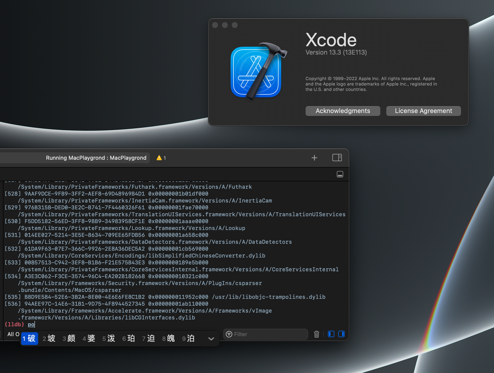

# Xcode Patch

> [Xcode is worst IDE I have ever used](https://www.reddit.com/r/iOSProgramming/comments/fmys59/xcode_is_worst_ide_i_have_ever_used/)

Xcode 13.3 introduced a very annoying bug. When you type anything with Chinese IME in the LLDB console, the whole app freezes! I did some investigation and fixed this issue before Apple publishes the next release.



If you can't stand this issue either, this patch is gonna help you. **But I highly recommend you to wait for the next release, because this approach will require you to re-sign your Xcode!**

## Instructions

### 1. Re-sign Xcode
There are many ways to re-sign Xcode. For example, I'm using a little [Python script](https://github.com/slegetank/ResignXcode) and it works pretty well. You can simply pick a method that you have been validated.

### 2. Validate Re-sign
Launch Xcode and try attaching it via LLDB. If it succeeded, everything is ok and keep going. Otherwise, you are not lucky today.

### 3. Compile the Patch
Open `XcodePatch.xcodeproj` and click the build button. Grab the produced `libXcodePatch.dylib` file and copy it to `/usr/local/lib`.

### 4. Inject the Patch

> Before modifying the executable file, consider backing it up first in case there are something unexpected happened and broke the executable. (Backing up only the main executable file is enough)

Now you need to make Xcode load the patch library. Here I will use Python with [LIEF](https://lief-project.github.io/) library.

If you haven't installed LIEF:

```bash
pip3 install lief
```

then execute the following script:

```python
import lief

xcode_fat = lief.MachO.parse("/path/to/Xcode.app/Contents/MacOS/Xcode")
xcode = xcode_fat.take(lief.MachO.CPU_TYPES.ARM64) # or `x86_64` for Intel-based Mac

patch_lib = lief.MachO.DylibCommand.weak_lib('/usr/local/lib/libXcodePatch.dylib')
xcode.add(patch_lib)

xcode.write("/path/to/Xcode.app/Contents/MacOS/Xcode")
```

### 5. Re-sign Xcode Again
Since you just modified the executable file of Xcode, you need to re-sign the bundle again. Don't worry, you had validated the possibility of self-signing Xcode earlier, just repeat the first step.

## Future Directions

* Make this repository a universal patch collection for Xcode.
* A easy-to-use re-signing tool.

## Known Issues

* Re-signing Xcode will make Apple Developer accounts integration unable to work (as well as "Automatically manage signing").

## Disclaimer

During your operations, Xcode can be broken and cannot be opened anymore. This is irrelevant to this repository. Please don't install this patch when you are urgent about doing your serious work or something.

This patch contains nothing malicious, read the code if you still have concern.